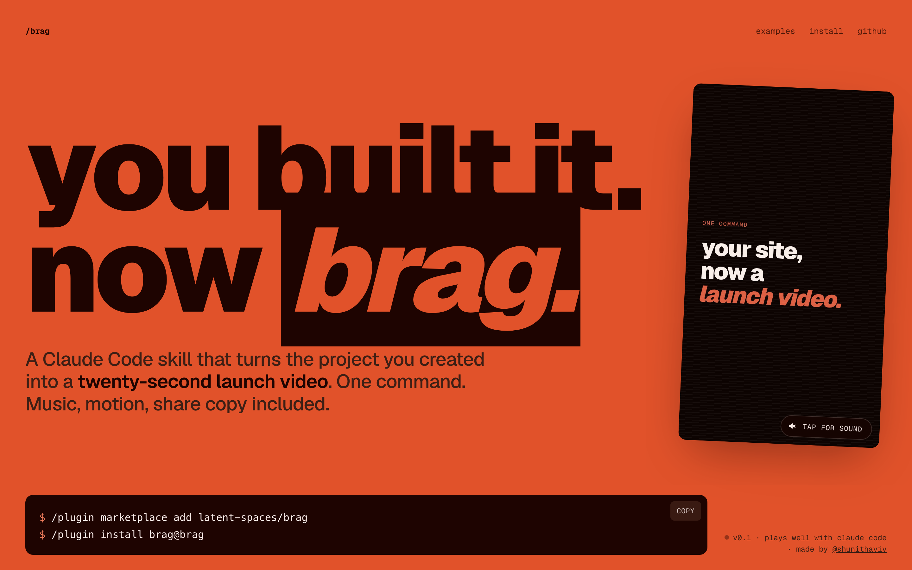

# /brag

**You built it. Now brag.**

Turn your project website into a short, polished, shareable launch video — music, motion, and share copy included. One command, powered by [Hyperframes](https://hyperframes.heygen.com/).

[](https://latent-spaces.github.io/brag/)

> Forked from [latent-spaces/brag](https://github.com/latent-spaces/brag) by Shunit Haviv. This fork adapts `/brag` to work with **any AI coding agent** — not just Claude Code.

## What this gives you

A `brag-output/` folder with:
- `brag-plan.md` — the creative concept and storyboard
- `composition-brief.md` — the brief handed to Hyperframes
- `composition/` — the Hyperframes video project
- `brag.mp4` — the rendered video
- `share-copy.txt` — tweet-ready share text

## Supported agents

| Agent | Install method |
|---|---|
| **Claude Code** | [`adapters/claude-code/`](adapters/claude-code/) — `.claude-plugin` manifest |
| **opencode** | [`adapters/opencode/`](adapters/opencode/) — `opencode.json` config |
| **Codex, Cursor, Aider, any LLM** | [`adapters/generic/`](adapters/generic/) — paste `AGENT.md` into custom instructions |
| **Any agent (direct)** | Read [`AGENT.md`](AGENT.md) and follow the workflow step by step |

## Install

### Claude Code

```bash
# Plugin install
/plugin marketplace add latent-spaces/brag
/plugin install brag@brag

# Or copy skill directly
rsync -a --exclude '.DS_Store' skills/brag/ ~/.claude/skills/brag/
```

### opencode

```bash
# Global install
git clone https://github.com/anukulKun/brag-cli.git ~/.config/opencode/skills/brag

# Or per-project
git clone https://github.com/anukulKun/brag-cli.git .opencode/skills/brag
```

### Generic (any agent)

1. Read [`AGENT.md`](AGENT.md) into your agent's context or custom instructions.
2. Ensure the skill assets are accessible (clone this repo or symlink `skills/brag/`).
3. Verify Hyperframes: `npx hyperframes doctor`

## Use it

```
let's /brag
/brag --tone "fake Series A launch from 2016"
/brag --tone chaotic --format vertical
```

### Options

| Option | Values | Default |
|---|---|---|
| `--tone` | preset or freeform description | inferred |
| `--format` | `landscape`, `vertical`, `square` | `landscape` |
| `--duration` | seconds | auto (15-25s) |
| `--no-music` | flag | music on |
| `--no-sfx` | flag | sfx on |
| `--title` | string | inferred from project |

Tone presets: `default`, `polished`, `yc-parody`, `chaotic`, `deadpan`, `cinematic`, `app-store`

## How it works

1. **Inspect** — reads your project code to understand the app
2. **Plan** — answers a 9-question rubric, picks a creative angle, storyboards
3. **Compose** — hands a focused brief to Hyperframes for video generation
4. **Deliver** — validates, renders `brag.mp4`, and writes share copy

## Requirements

- Node.js 22+
- FFmpeg on `PATH`
- Hyperframes CLI — `npx hyperframes doctor` to verify

## Repo structure

```
brag/
├── AGENT.md                      ← Core skill (agent-agnostic, single source of truth)
├── README.md                     ← This file
├── LICENSE
├── .gitignore
├── skills/
│   └── brag/
│       ├── SKILL.md              ← Thin wrapper (references AGENT.md)
│       ├── references/           ← Step-by-step guides, tone definitions, audio docs
│       ├── assets/               ← Music tracks + 200+ SFX files
│       └── scripts/              ← Music cue analyzer (Python)
├── adapters/
│   ├── claude-code/              ← .claude-plugin manifest for Claude Code
│   ├── opencode/                 ← opencode.json config for opencode
│   └── generic/                  ← Instructions for any agent without plugin system
├── examples/                     ← Fake product sites (benchmark suite)
└── docs/                         ← Launch site (GitHub Pages)
```

## Credits

- **Original creator:** [Shunit Haviv](https://github.com/latent-spaces/brag) — `/brag` was originally built as a Claude Code skill by [latent-spaces](https://github.com/latent-spaces)
- **Music:** [ende.app](https://ende.app/en) "Happy Beats / Business Moves"
- **Sound effects:** [Kenney](https://kenney.nl/)
- **Video generation:** [Hyperframes](https://hyperframes.heygen.com/)
- **Fake demo sites:** built with [Impeccable](https://impeccable.style/)

## License

MIT — see [LICENSE](LICENSE)
